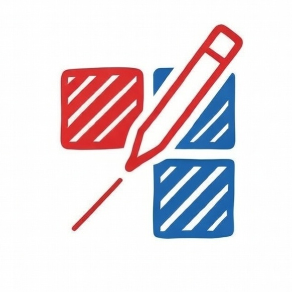

 

# Connect, Square!

  

**Connect, Square!** is a modern, strategic game of territory and connections built with Svelte 5. Compete against friends or AI to capture the most territory on a grid by drawing lines and completing squares.

## How to Play

The objective is simple: **Capture more squares than your opponents.**

For detailed game rules, turn structure, and scoring mechanics, please refer to [connect_square.md](connect_square.md).

1.  **Start:** Each player starts from a corner of the grid.
2.  **Turn:** On your turn, select one of your existing points and connect it to an adjacent empty point.
3.  **Capture:** If your line completes one or more 1x1 squares, those squares are captured in your color, and you get an extra move.
4.  **Connect:** You can only draw lines from points you already "own" (points that are part of your lines).
5.  **Win:** The game ends when the squares are full or no moves are possible. The player with the highest score wins!

## Features

- **Dynamic Game Setup:** Choose your grid size (from 4x4 to 12x12) and number of players.
- **Smart AI Bots:** Play solo against multiple AI difficulty levels (Random, Greedy, etc.).
- **Responsive Design:** Fully playable on mobile, tablet, and desktop.
- **Theme Support:** Beautiful light and dark modes with system preference detection.
- **Interactive UI:** Smooth animations, score tracking, and real-time game status updates.
- **Edit Mode:** A special mode for developers or game masters to manipulate the board state.

## Tech Stack

- **Frontend:** [Svelte 5](https://svelte.dev/) (utilizing the latest Runes API for reactive state management)
- **Framework:** [SvelteKit](https://kit.svelte.dev/)
- **Styling:** [Tailwind CSS 4](https://tailwindcss.com/)
- **Icons:** [Lucide Svelte](https://lucide.dev/)
- **Testing:** [Playwright](https://playwright.dev/) for E2E testing
- **Build Tool:** [Vite](https://vitejs.dev/)

## Development

### Prerequisites

- [Node.js](https://nodejs.org/) (Latest LTS recommended)
- [npm](https://www.npmjs.com/) or [bun](https://bun.sh/)

### Getting Started

1.  **Clone the repository:**

    ```bash
    git clone https://github.com/your-username/connect-square.git
    cd connect-square
    ```

2.  **Install dependencies:**

    ```bash
    npm install
    # or
    bun install
    ```

3.  **Run the development server:**

    ```bash
    npm run dev
    # or
    bun run dev
    ```

4.  **Open your browser:**
    Navigate to `http://localhost:5173` to see the game in action!

### Available Scripts

- `npm run dev` - Start development server
- `npm run build` - Create a production build
- `npm run preview` - Preview the production build
- `npm run check` - Run Svelte-check for TypeScript/Svelte validation
- `npm run lint` - Run Prettier for code formatting
- `npm run test` - Run Playwright E2E tests

## License

This project is private and for educational purposes.

---

Made with love using Svelte 5.
